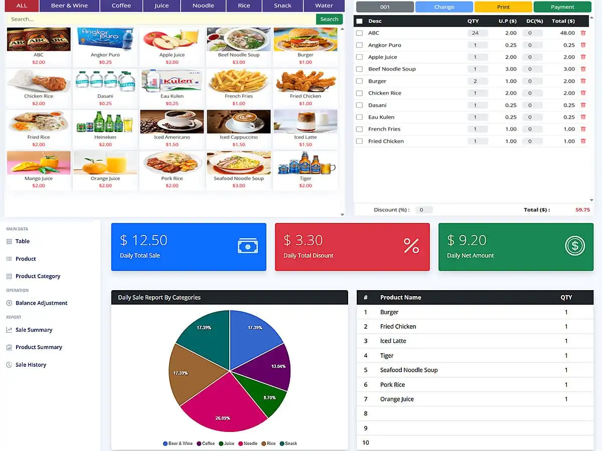

# Laravel Vue.js POS Tutorial for Beginners

<p align="center"><a href="https://laravelcenter.com/https://laravelcenter.com/laravel-vue-js-pos-tutorial" target="_blank"></a></p>

[](https://laravel.com/)
[](https://vuejs.org/)
[](https://getbootstrap.com/)
[](https://www.php.net/)
[]()

This repository contains the complete source code for the tutorial:  
👉 **Laravel Vue.js POS Tutorial – Complete Beginner’s Guide**  
Read the full tutorial here:  
https://laravelcenter.com/laravel-vue-js-pos-tutorial/

This project is built for **beginner developers** who want to learn how to create a modern POS system using **Laravel, Vue.js, Bootstrap, Axios, and Sanctum**.  
You will learn how to build a full SPA with authentication, product management, cart system, sales processing, and reporting.

---

## 🚀 Features

- Full SPA authentication with Laravel Sanctum  
- POS dashboard built with Bootstrap 5 + Vue 3  
- Product CRUD (Create, Read, Update, Delete)  
- POS cart system with quantity update & auto-calculation  
- Axios-powered API requests  
- Sales history and reporting page  
- Responsive Vue.js layout with sidebar navigation  
- Clear folder structure for beginners  

---

## 🛠 Installation

```bash
# Clone this repository
git clone https://github.com/YourUsername/laravel-vuejs-pos-beginners.git
cd laravel-vuejs-pos-beginners

# Install backend dependencies
composer install

# Install frontend dependencies
npm install

# Compile frontend assets
npm run dev

# Create environment file
cp .env.example .env
php artisan key:generate

# Run database migrations
php artisan migrate --seed

# Start development server
php artisan serve

```
### **Default User Accounts**

The following table lists the pre-configured user accounts and their corresponding default passwords:

| Username | Role | Default Password |
| :--- | :--- | :--- |
| `superadmin` | Highest level of access (Configuration, User Management, etc.) | `123456` |
| `admin` | Standard administrative privileges (Content/Data Management) | `123456` |
| `cashier` | Restricted access (Point-of-Sale, Transaction Processing) | `123456` |

## 📦 Tech Stack
- Laravel 12
- jQuery 3
- Bootstrap 5
- Ajax
- PHP 8.3
- MySQL

## 🔗 Tutorial
Follow the full step-by-step tutorial here:
[**https://laravelcenter.com/https://laravelcenter.com/laravel-vue-js-pos-tutorial**](https://laravelcenter.com/https://laravelcenter.com/laravel-vue-js-pos-tutorial/)

## 📌 Topics / Tags
`laravel` | `vuejs` | `pos` | `laravel-tutorial` | `vue3` | `spa` | `bootstrap5` | `axios` | `laravel-sanctum` | `inventory-system` | `point-of-sale` | `beginners`


## ⭐ Support
If you found this project helpful, please star the repository ⭐    
Your support motivates me to create more free tutorials!